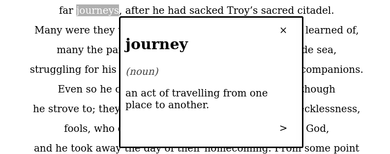

## Click-dictionary

A Mozilla Firefox addon to display word definitions when double-clicking on them.

:point_right: [Download](https://addons.mozilla.org/en-US/firefox/addon/click-dictionary2/)

## Features

- Gets word definitions from the [Free Dictionary API](https://dictionaryapi.dev/).
- Displays word definition in a separate pop-up window.
- Click on the `<` and `>` buttons to get the next word definition.
- Lightweight and zero dependencies.

## Usage

Get the addon from the [Mozilla Firefox page](https://addons.mozilla.org/en-US/firefox/addon/click-dictionary2/) and install it.

Alternatively, you can test it without installation by cloning this repo and opening `index.html` on your preferred browser.

## License

MIT
